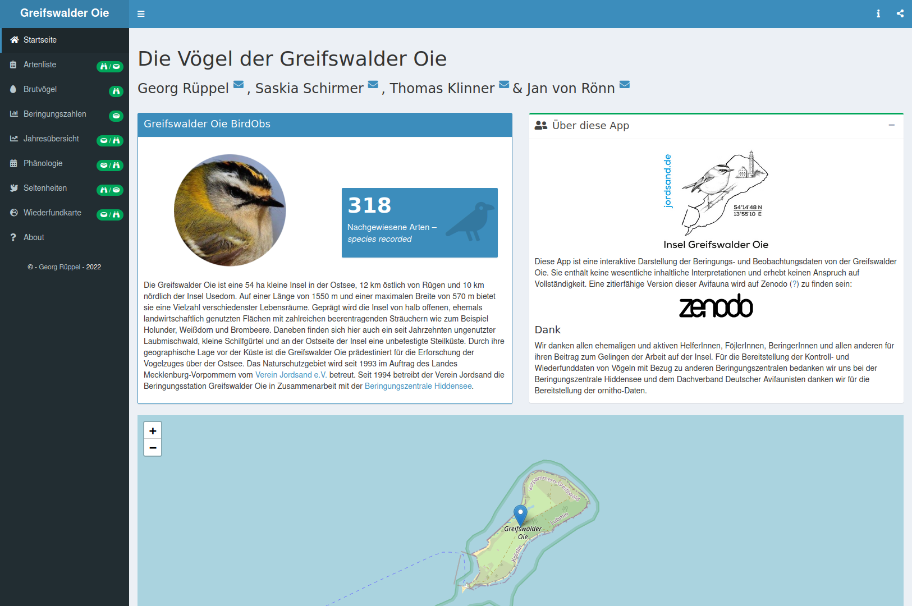

# Shinyapp Greifswalder Oie 

### [Georg Rüppel](https://github.com/g-rppl), [Saskia Schirmer](https://github.com/SaskiaSchirmer), Thomas Klinner & [Jan von Rönn](https://github.com/jacvr)

## Info

Diese App ist eine interaktive Darstellung der Beringungs- und Beobachtungsdaten von der Greifswalder Oie. Sie enthält keine wesentliche inhaltliche Interpretationen und erhebt keinen Anspruch auf Vollständigkeit. Eine zitierfähige Version dieser Avifauna wird auf Zenodo zu finden sein:

## Aktuell laufenden Apps

* [Dashboard](https://g-rppl.shinyapps.io/goie_shiny)

## PWA Unterstützung

Diese App besitzt einen PWA (Progressive Web App) Unterstützung und kann auf vielen mobilen Geräten als full screen App angezeigt werden: Öffne den Link der App ([https://g-rppl.shinyapps.io/goie_shiny](https://g-rppl.shinyapps.io/goie_shiny)) in einen mobilen Browser und wähle unter den Einstellungen des Browsers "Installieren" (andriod) oder unter "Teilen" "Zum Home-Bildschirm hinzufügen" (iOS). Die App lässt sich so zum Homesceen hinzufügen.

## Dank
Wir danken allen ehemaligen und aktiven HelferInnen, FöjlerInnen, BeringerInnen und allen anderen für ihren Beitrag zum Gelingen der Arbeit auf der Insel. Für die Bereitstellung der Kontroll- und Wiederfunddaten von nicht auf der Insel beringten oder nicht auf der Insel wiedergefundenen Vögeln bedanken wir uns bei der [Beringungszentrale Hiddensee](https://www.beringungszentrale-hiddensee.de/).
